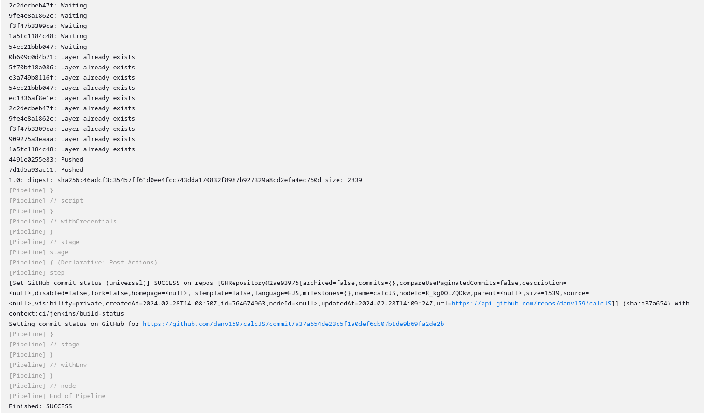

# PIPELINE EN JENKINS
En esta presentación se detallaran las instrucciones para implementar un pipeline en Jenkins que realice las siguientes operaciones, con la finalidad de desplegar una aplicacion almacenada en un repositorio de github.
* Si se realiza un cambio en algún archivo de proyecto en github, se hace el llamado para iniciar el job de la pipeline en Jenkins mediante webhooks.
* Posteriormente el job en Jenkins descarga el proyecto del respositorio y con una herramienta de análisis (Sonarqube), se realiza un análisis de código y de seguridad a los archivos que componen la aplicación.
* Una vez superadas las pruebas con Sonarqube, se envía un reporte por correo con los resultados obtenidos del análisis.
* A continuación se crea una imagen en Docker de la aplicación, se crea y ejecuta un contenedor. Tambien se sube la imagen creada al repositorio Docker HUB.
* Finalmente se realiza un "set commit status" en el repositorio del proyecto en github.

## 1.- PRE-REQUISITOS Y CONFIGURACIÓN PREVIA
### 1.1.- JENKINS
Tener instalado y configurado Jenkins en el equipo.  
Tener configurado un nodo en Jenkins accesible por ssh desde terminal, con Java instalado y una carpeta para los archivos usados por jenkins. 

### 1.2.- SONARQUBE
  
SonarQube es una plataforma para evaluar código fuente. Es software libre y usa diversas herramientas de análisis estático de código fuente como Checkstyle, PMD o FindBugs para obtener métricas que pueden ayudar a mejorar la calidad del código de un programa.​

Se debe tener instalado y configurado SONARQUBE. Pueden seguirse las instrucciones detalladas en la [documentacion oficial](https://docs.sonarsource.com/sonarqube/latest/setup-and-upgrade/overview/).
#### 1.2.1.- Configurar un token en Sonarqube
En las configuraciones de Sonarquebe del usuario admin: Account/My Account/Security. 
#### 1.2.2.- Instalar el plugin de Sonarqube en Jenkins y configurarlo
Esto en las configuraciones de: Panel de control/Administrar Jenkins/Plugins.

Configurar los datos del servidor de Sonarqube en: Panel de control/configurar Jenkins/System. Previamente debe configurarse una credencial tipo secret text con el token generado anteriormente y usarlo en esta configuracion
Configurar el sonar-scanner en: Panel del control/Administar Jenkins/Tools. 
### 1.3.- GITHUB
Tener accesso a una cuenta de Github en la cual se almacena el repositorio con la aplicación a usar.


#### 1.3.1.- Tener configurado un token en la cuenta de Github


Tambien en la configuracion de Jenkins: Panel de control/Administrar Jenkins/System.  
Previamente debe haberse creado una credencial tipo secret text con el valor del token y usarse en esta configuracion.  
Marcar la opcion de: Manage hooks.


#### 1.3.2.- Tener configurado la opcion de conexion por ssh a Github
De acuerdo a las instrucciones de la [documentacion de Github](https://docs.github.com/en/authentication/connecting-to-github-with-ssh) al respecto.

Ademas de las credenciales tipo SSH (usando la private key del paso de la anterior linea) en Jenkins


#### 1.3.3.- Configurar un webhook en los ajustes del proyecto en Github.
Donde se debe introducir un enlace accesible desde internet de nuestro servidor Jenkins, seguido de "/github-webhook/". Puede usarse una aplicacion como ngrok para tener este enlace de forma sencilla.


### 1.4.- DOCKER
Se debe tener instalado Docker en el equipo que ejecutará el job de Jenkins, en este caso el nodo.

## 2.- PIPELINE EN JENKINS
Crear un nuevo job de tipo pipeline en jenkins y configurar las siguientes opciones:  

* Marcar la opción de Github project y colocar la url tipo SSH del repositorio.
* Marcar la opción GitHub hook trigger for GITScm polling. Esto para que los cambios realizados en el proyecto en Github disparen la ejecución del job.


* En la sección de Pipeline, llenar el campo de URL de repositorio con el enlace tipo SSH del repositorio, junto a sus credenciales SSH del paso 1.3.2.
* Colocar la ruta y nombre de archivo en el repositorio del archivo Jenkinsfile, el cual contiene las etapas y pasos que sigue la pipeline al ejecutarse el job.


### 2.1.- ARCHIVO JENKINSFILE

``` Groovy
//para hacer el commit status
void setBuildStatus(String message, String state) {
  step([
      $class: "GitHubCommitStatusSetter",
      reposSource: [$class: "ManuallyEnteredRepositorySource", url: "https://github.com/danv159/calcJS"],
      contextSource: [$class: "ManuallyEnteredCommitContextSource", context: "ci/jenkins/build-status"],
      errorHandlers: [[$class: "ChangingBuildStatusErrorHandler", result: "UNSTABLE"]],
      statusResultSource: [ $class: "ConditionalStatusResultSource", results: [[$class: "AnyBuildResult", message: message, state: state]] ]
  ]);
}


pipeline{
    agent{
        label 'virtualAgeticDAN'
    }
    // parameters{

    // }
    // environment{
        
    // }
    stages{
        
        
        
        stage('analisis de codigo con sonarqube'){
            steps{
                script{
                    def scannerHome = tool 'sonarqube';
                    
                    withSonarQubeEnv('sonarqube') {
                        sh """${scannerHome}/bin/sonar-scanner \
                            -Dsonar.projectKey=analisis_construccion \
                            -Dsonar.projectName=analisis_construccion \
                            -Dsonar.projectVersion=1.0 \
                            -Dsonar.sources=/home/danv/jenkinsNode/workspace/analisis_construccion \
                            -Dsonar.language=javascript \
                            -Dsonar.sourceEncoding=UTF-8 \
                            -Dsonar.report.export.path=/home/danv/jenkinsNode/workspace/analisis_construccion/sonar-report.pdf
                        """
                    }
                }
            }
            
        }
        stage("Quality Gate") {
            
            steps {
                timeout(time: 10, unit: 'MINUTES') {
                          waitForQualityGate abortPipeline: true
                      }
              }

        stage('Send Email') {
            steps {
               
                script {
                    emailext body: 'Adjunto el reporte de SonarQube generado',
                             subject: 'Reporte de SonarQube',
                             mimeType: 'text/html',
                             attachLog: true,
                             compressLog: true,
                             attachmentsPattern: 'test.zip',
                             to: 'danielmundero123@gmail.com'
                }
            }
        }

        stage('build'){
              steps{
                               
                  withCredentials([string(
                      credentialsId:'dockerhubTOKEN',
                      variable:'tokendocker'
                  )])
                  {
                      script{
                          sh "docker build -t calcjs:1.0 .";
                          sh "docker run -d --name calcjs -p3000:3000 calcjs:1.0";
                          sh "echo $tokendocker | docker login -u danv159 --password-stdin";
                          sh "docker tag calcjs:1.0 danv159/calcjs:1.0";
                          sh "docker push danv159/calcjs:1.0";
                      }
                  }
              }
        }
        
    }
    post {
    success {
        setBuildStatus("Build succeeded", "SUCCESS");
    }
    failure {
        setBuildStatus("Build failed", "FAILURE");
    }
  }
}
```
Las etapas o "stages" en el código, inician con el analisis de código con SONARQUBE y una etapa que "Gate" que deja continuar o detiene el pipeline de acuerdo al resultado del análisis, seguido del envio de un email con el reporte de resultados, como última etapa tenemos la construcción de una imagen de la aplicación usando docker, que finalmente realiza un despliegue en un contenedor y un "push" hacia un repositorio de Dockerhub.

La última sección del codigo se ejecuta una vez terminadas las etapas, y realiza la actualización del estado del commit de los cambios realizados hacia Github.

### 2.2.- ARCHIVO DOCKERFILE

``` yaml
#uso de la imagen de nodejs como base para la construccion de la imagen de la app
FROM node:latest
#creacion del directorio de la app dentro de la imagen
RUN mkdir -p /home/app/
#directorio de trabajo dentro de la imagen
WORKDIR /home/app/
#copiar las dependencias de la app del entorno local a la imagen
COPY . .
#la app usa el puerto 3000
EXPOSE 3000
#instalando npm dentro de la imagen
RUN npm install
#comando de ejecucion de la app dentro de la imagen
CMD ["node","app"]
```

Al ejecutarse se encarga de la creacion de una imagen de Docker que contiene la aplicacion, a partir de la cual se construirá y ejecutará un contenedor Docker para la puesta en funcionamiento del proyecto.

## 3.- FUNCIONAMIENTO DEL JOB
Al ejecutarse el Job de Jenkins ya sea por hacer algun cambio en el repositorio o manualmente, se muestra la ejecución de las distintas etapas del pipeline. Asi como los resultados mostrados por consola.



